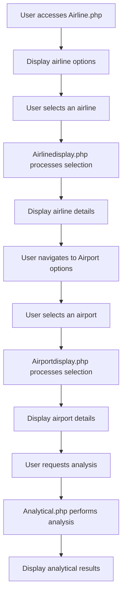

# Architecture Overview

### High-Level Overview

The system combines PHP server-side scripting with JavaScript for client-side interactivity, leveraging AJAX for autocomplete features and dynamic data fetching. The frontend layout relies on CSS styling, and analytical operations are handled via dedicated PHP scripts.

### Core Concepts

- **Frontend:**
  - HTML pages structured with consistent layout and navigation.
  - jQuery and jQuery UI for dynamic features such as autocomplete.
  - JavaScript modules (`app.js`, `helper.js`) for data generation and helper functions.

- **Backend:**
  - PHP scripts handle database connections, queries, and data presentation.
  - PHP includes like `airlinesearch.php`, `airportsearch.php`, `autocomplete.php`, `images/autocomplete.php` provide data endpoints.
  - PDO is used for secure database interactions.

- **Data Storage:**
  - MySQL database with tables for airlines, airports, routes, reservations, etc.

- **Analytical Operations:**
  - Implemented via PHP scripts that generate HTML tables to display processed data.
  - User input via forms for drill-down and pivot operations.

### Architecture Diagrams

*Note:* Include diagrams here if available or generate visual architecture diagrams showing the interaction between frontend, backend, and data sources.

[Architecture Diagram](#) (link placeholder)

---

## Architecture Diagrams

### Architecture Diagram 1

```mermaid
graph TD
    subgraph "Main Components"
        AirlinePHP[Airline.php]
        AirlinedisplayPHP[Airlinedisplay.php]
        AirportPHP[Airport.php]
        AirportdisplayPHP[Airportdisplay.php]
        AnalyticalPHP[Analytical.php]
        HomePHP[Home.php]
        RoutePHP[Route.php]
        RoutesdisplayPHP[Routesdisplay.php]
        airlinesearchPHP[airlinesearch.php]
        airportsearchPHP[airportsearch.php]
        dicePHP[dice.php]
        drillPHP[drill.php]
        drillupPHP[drillup.php]
        iternaryPHP[iternary.php]
        imagesAutocompletePHP[images/autocomplete.php]
        imagesDemoPHP[images/demo.php]
        jsApp[js/app.js]
        jsHelper[js/helper.js]
        readmeMD[readme.md]
        readmeMD2[Readme.md]
    end

    subgraph "Frontend"
        HTML[HTML]
        CSS[CSS]
        JavaScript[JavaScript]
        JSON[JSON]
    end

    subgraph "Assets"
        Images[images/]
        Scripts[js/]
    end

    %% Relationships between PHP files and frontend components
    HomePHP -->|renders|HTML
    AirlinedisplayPHP -->|renders|HTML
    AirportdisplayPHP -->|renders|HTML
    RoutesdisplayPHP -->|renders|HTML
    iternaryPHP -->|renders|HTML
    jsApp -->|interacts with|HTML
    jsHelper -->|used by|jsApp
    imagesAutocompletePHP -->|used by|HTML
    imagesDemoPHP -->|used by|HTML

    %% Data flow and dependencies
    AirlinePHP -->|uses|JSON
    AirportPHP -->|uses|JSON
    RoutePHP -->|uses|JSON
    AnalyticalPHP -->|uses|JSON
    airlinesearchPHP -->|queries|AirlinePHP
    airportsearchPHP -->|queries|AirportPHP
    dicePHP -->|uses|JavaScript
    drillPHP -->|uses|JavaScript
    drillupPHP -->|uses|JavaScript
    iternaryPHP -->|uses|JavaScript

    %% Assets and scripts
    jsApp -->|loads|jsHelper
    jsApp -->|loads|js/package.json
    jsApp -->|loads|js/package-lock.json
    imagesAutocompletePHP -->|uses|images/autocomplete.php
    imagesDemoPHP -->|uses|images/demo.php

    %% External dependencies
    readmeMD -->|documentation|Readme.md
    readmeMD2 -->|documentation|Readme.md
```

### Architecture Diagram 2

